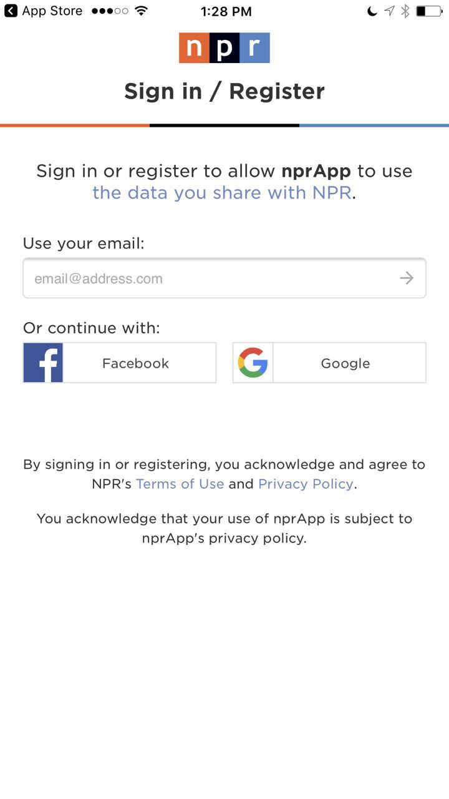
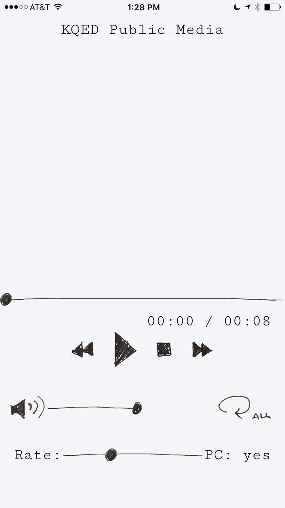

<h1>React Native APP</h1>

Expo demo link: https://expo.io/@hunter829/nprNews

1.A react native app to stream npr news with a simple interface

2.whole oauth flow by following the npr news authentication flow
(http://dev.npr.org/api/#/authorization) 

3.initiate a api call to the npr news
stream endpoint (GET /listening/v2/recommendation) to get a list of audio items.

4.react native media player to start playing the list of audio contents from step 6 and rendering the progress through a progress bar

5.Build and push app to https://expo.io/

</img>
</img>

